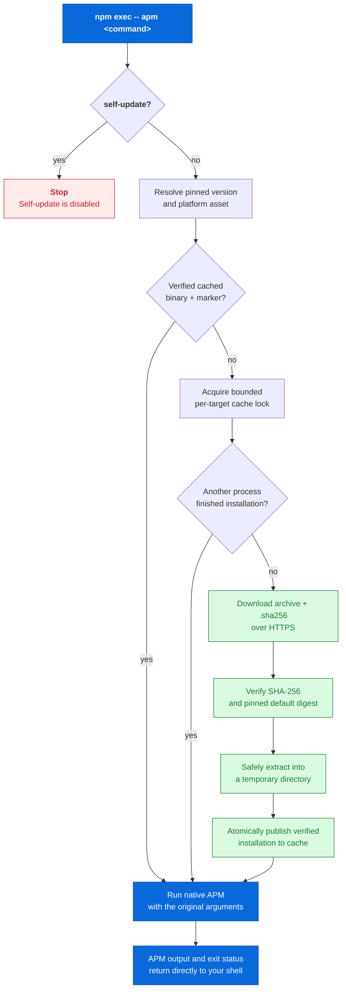

<div align="center">

# `@mgrilec/apm`

**A verified npm launcher for the [Microsoft APM CLI](https://github.com/microsoft/apm).**

Install it once; on first use, it securely fetches the matching native APM release, verifies it, caches it, and runs it.

[](https://github.com/mgrilec-vibe/microsoft-apm-npm/actions/workflows/ci.yml)
[](https://www.npmjs.com/package/@mgrilec/apm)
[](https://nodejs.org/)
[](LICENSE)

[Quick start](#quick-start) · [How it works](#how-it-works) · [Configuration](#configuration) · [Security model](#security-model)

</div>

> [!IMPORTANT]
> This is an independent wrapper and is not affiliated with or endorsed by Microsoft. Microsoft APM itself is MIT-licensed by Microsoft.

## Why this package?

Microsoft APM ships native binaries. This package makes that CLI available through the normal npm workflow without hiding the provenance of the binary that actually runs.

- **Pinned by default** — installs Microsoft APM **0.26.0**, so an upstream release cannot silently change an existing npm installation.
- **Verified before execution** — downloads the archive and its upstream SHA-256 sidecar over HTTPS; the default release is additionally checked against a digest embedded in this package.
- **Cached per platform and version** — only the first run for a given target needs a download.
- **Transparent at the command line** — APM arguments, output, exit code, and signals pass through unchanged.
- **Safe for concurrent first runs** — a bounded cache lock ensures one installation wins cleanly.

## Quick start

**Requirements:** Node.js 20 or later. The first invocation needs access to GitHub, or to a configured HTTPS mirror.

```sh
npm install --save-dev @mgrilec/apm
npm exec -- apm --version
npm exec -- apm install microsoft/apm
```

For repeated use, add a script:

```json
{
  "scripts": {
    "apm": "apm"
  },
  "devDependencies": {
    "@mgrilec/apm": "^0.1.0"
  }
}
```

Then invoke any upstream command through npm:

```sh
npm run apm -- --version
npm run apm -- install microsoft/apm
```

## How it works

The wrapper is intentionally small: it owns installation and verification; the downloaded native APM binary owns every normal APM command.



<details>
<summary><strong>Step-by-step flow</strong> — fallback for renderers without Mermaid</summary>

1. The launcher rejects `apm self-update`, because it would replace the verified binary.
2. It resolves an explicit Microsoft APM version and the native asset for the current platform.
3. A usable cached installation is run immediately. Otherwise, concurrent launchers coordinate through a bounded lock.
4. The winning launcher downloads the release archive and adjacent checksum sidecar over HTTPS.
5. It verifies the archive's SHA-256. For the default version, both the upstream sidecar and the archive must match the wrapper's embedded digest.
6. It extracts into a temporary directory, records the verified release marker, then publishes that installation into the cache.
7. The native executable receives the original command-line arguments and inherits your terminal I/O.

</details>

## Supported targets

| Operating system | CPU architecture | Upstream asset |
| --- | --- | --- |
| macOS | Intel (`x64`) | `apm-darwin-x86_64.tar.gz` |
| macOS | Apple Silicon (`arm64`) | `apm-darwin-arm64.tar.gz` |
| Linux | `x64` | `apm-linux-x86_64.tar.gz` |
| Linux | `arm64` | `apm-linux-arm64.tar.gz` |
| Windows | `x64` / `arm64` | `apm-windows-x86_64.zip` |

Windows on ARM uses Microsoft APM's x86_64 Windows release. Linux native releases require glibc 2.35 or later. APM itself requires Git for dependency operations.

## Configuration

The defaults are secure and require no configuration. Set environment variables only when you need a different version, cache location, enterprise mirror, or timing behavior.

| Variable | Default | Purpose |
| --- | --- | --- |
| `MICROSOFT_APM_VERSION` | `0.26.0` | An explicit upstream semantic version, with an optional `v` prefix. |
| `MICROSOFT_APM_CACHE_DIR` | Platform cache directory | Directory used for verified APM installations. |
| `MICROSOFT_APM_DOWNLOAD_BASE_URL` | GitHub releases | HTTPS mirror base URL; it must expose `v<version>/<asset>` and `<asset>.sha256`. |
| `MICROSOFT_APM_DOWNLOAD_TIMEOUT_MS` | `120000` | Positive per-download timeout in milliseconds. |
| `MICROSOFT_APM_LOCK_TIMEOUT_MS` | `120000` | Positive maximum wait for a concurrent installation. |
| `MICROSOFT_APM_LOCK_STALE_MS` | `900000` | Positive inactivity period before reclaiming an abandoned lock. |

Unless `MICROSOFT_APM_CACHE_DIR` is set, the cache directory is:

- `%LOCALAPPDATA%/microsoft-apm` on Windows when `LOCALAPPDATA` is set;
- `$XDG_CACHE_HOME/microsoft-apm` when `XDG_CACHE_HOME` is set;
- `~/.cache/microsoft-apm` otherwise.

`HTTP_PROXY`, `HTTPS_PROXY`, and `NO_PROXY` (including lowercase forms) are honored for downloads. For a private certificate authority, use Node's `NODE_EXTRA_CA_CERTS`; TLS certificate validation is never disabled.

### Selecting another Microsoft APM release

Choose a published release explicitly; the wrapper never discovers tags on your behalf:

```sh
MICROSOFT_APM_VERSION=0.26.0 npm exec -- apm --version
```

Versions other than `0.26.0` still require a valid upstream SHA-256 sidecar, but do not have an embedded release digest. Select an alternate version only when you explicitly trust it.

## Security model

| Protected property | Wrapper behavior |
| --- | --- |
| **Version predictability** | The default version is fixed in the package; a version override must be explicit semver. |
| **Download integrity** | The archive is SHA-256 verified against its sidecar. The default assets are also pinned to package-embedded digests. |
| **Transport** | Download endpoints must be credential-free HTTPS URLs; certificate validation remains enabled. |
| **Archive safety** | Entries must stay under the expected archive root and cannot use unsafe path segments; tar archives accept regular files and directories only. |
| **Cache integrity** | The executable and a release marker must both exist before a cache entry is trusted. Installation uses temporary directories and a per-target lock. |
| **Executable provenance** | The wrapper only runs the verified cached executable; it never falls back to an arbitrary `apm` on `PATH`. |
| **Post-install updates** | `apm self-update` is rejected, preserving the verified executable. Update this npm package or set an explicit version instead. |

## Development

```sh
npm ci
npm test
npm pack --dry-run
```

CI runs the test suite and validates the publishable package on Node.js 20 and 22.

## Publishing

The published tarball contains only the launcher source, this README, and the MIT license. Releases are published by [the release workflow](.github/workflows/publish.yml) when a GitHub release tag matches `package.json`.

The first release uses an npm automation token with publish access to the `@mgrilec` scope. Later releases use npm trusted publishing through GitHub Actions OIDC; `NPM_TOKEN` can then be removed.

```sh
npx --yes npm@^11.15.0 trust github @mgrilec/apm \
  --repository mgrilec-vibe/microsoft-apm-npm \
  --file publish.yml \
  --allow-publish
```

## Support and license

- Read [CONTRIBUTING.md](CONTRIBUTING.md) before opening an issue or pull request.
- Review the [Code of Conduct](CODE_OF_CONDUCT.md) and [support boundaries](SUPPORT.md).
- Report wrapper defects through the [bug-report form](https://github.com/mgrilec-vibe/microsoft-apm-npm/issues/new?template=bug.yml); use a blank issue for questions or proposals.
- For Microsoft APM itself, see the [upstream repository](https://github.com/microsoft/apm).
- Distributed under the [MIT License](LICENSE).
