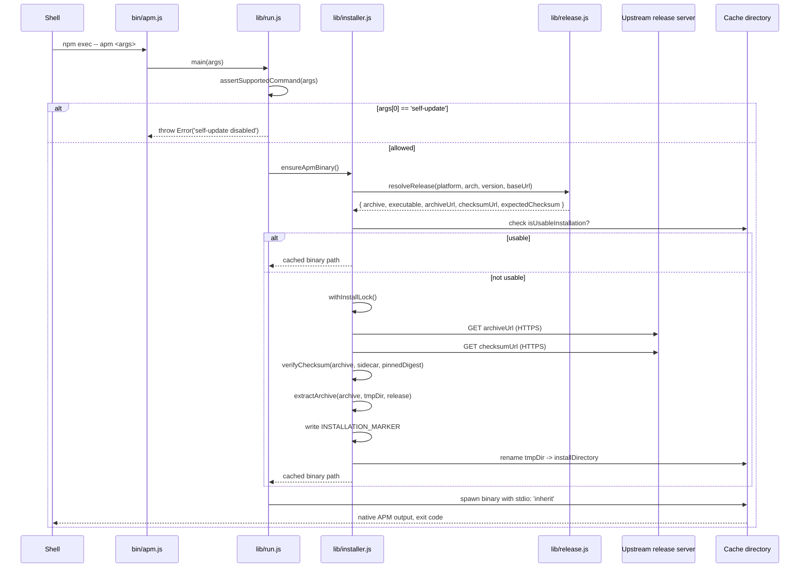

# Architecture

This is the long-form source-level walk-through for `@mgrilec/apm`. The [README](../README.md) is the user manual; this page is for maintainers and security reviewers who need to read the code.

## Repository layout

```
.
├── bin/
│   └── apm.js            # the executable entry point
├── lib/
│   ├── run.js            # orchestration: command check + spawn
│   ├── installer.js      # download, verify, cache, lock
│   └── release.js        # version URL platform asset mapping
├── test/
│   ├── installer.test.js # unit tests for installer
│   ├── release.test.js   # unit tests for release resolver
│   └── hardening.test.js # end-to-end behavior under hostile inputs
├── docs/                 # this handbook
├── package.json          # package metadata + `node --test` script
├── LICENSE               # MIT license
├── README.md             # user manual
├── CONTRIBUTING.md       # contribution contract
├── SUPPORT.md            # support boundaries
├── CODE_OF_CONDUCT.md    # community standards
└── CHANGELOG.md          # per-version history
```

The published tarball contains only `bin/`, `lib/`, `README.md`, and `LICENSE`. Verify with `npm pack --dry-run`.

## Module roles

- `bin/apm.js` is the shell entry. It imports `run.js`'s `main` and propagates the exit code.
- `lib/run.js` owns the orchestration: it asserts that the requested command is not `self-update`, calls `ensureApmBinary`, and spawns the verified executable with the original arguments.
- `lib/installer.js` owns the install path. It is the largest file because it owns every cache and verification concern.
- `lib/release.js` owns metadata: which upstream version exists, which archive and checksum to fetch for the current `(platform, arch)`, and validation of the `MICROSOFT_APM_DOWNLOAD_BASE_URL` and `MICROSOFT_APM_VERSION` inputs.

## Startup sequence



## Detail by concern

### Command check

`assertSupportedCommand` rejects `apm self-update` because allowing it would mean the launcher's verification is moot — any user could replace the cached binary with any bytes Microsoft APM (or a network attacker) chose. Disabling the command does not disable the upstream binary's ability to fetch a different Microsoft APM at the next invocation of the upstream's `install` command; that path is upstream behavior. To upgrade Microsoft APM, change `MICROSOFT_APM_VERSION` or bump the npm package.

### Platform selection

`resolveRelease` keys `PLATFORM_ASSETS` by `${platform}-${arch}`. If the key is missing, it raises with the list of supported keys. The launcher does **not** attempt to fall back to a different platform's binary; the only fallback it offers is Windows on ARM using the `apm-windows-x86_64.zip` archive, which is part of the table itself.

### Cache key

The cache root (`cacheRoot`) is the user cache directory by default, or `MICROSOFT_APM_CACHE_DIR` if set. Each `installation` is keyed by:

```
<cache-root>/<version>/<platform>-<arch>/
```

Upgrading from `0.26.0` to `0.27.0` does not invalidate the older cache; only the new version's directory is created. Downgrading (or changing `MICROSOFT_APM_DOWNLOAD_BASE_URL` to a mirror) similarly leaves the existing install in place under its own key.

### Installation marker

`isUsableInstallation` is the gate that decides whether the cached binary can be executed without re-downloading. It requires:

1. The executable exists and is launchable (on POSIX, `X_OK`).
2. The marker `.microsoft-apm-npm-layout-v2` exists and contains exactly the upstream tag (`v<version>`).

A partial install (a directory with the executable but no marker) is treated as absent. The marker is a plain UTF-8 text file; it is *not* a signature, on purpose: its job is to detect inconsistent cache state, not to attest binary identity. Binary identity is enforced at install time, not at run time.

### Locking

The lock is a directory at `<installDirectory>.lock`. Inside it the lock-holder writes `owner.json` containing `pid` and `startedAt`. The launcher:

- `mkdir`s the lock directory atomically (`EEXIST` means another launcher has it).
- Re-stamps `owner.json`'s `mtime` every `min(max(1s, stale/3), 30s)` until release.
- Uses `mtime` to detect abandoned locks: if `Date.now() - mtimeMs > MICROSOFT_APM_LOCK_STALE_MS`, the directory is reclaimable.
- Re-checks the cache after acquiring the lock so that two parallel first-runs converge on a single install.

For a single-host stress test, the lock holds for the duration of the (rare) first install only. Steady-state runs do not touch the lock at all.

### Download

`download` uses `undici`'s `fetch` wrapped in an `EnvHttpProxyAgent` when `HTTP_PROXY`/`HTTPS_PROXY` is set. The response body is streamed to a `wx` (exclusive-create) flag destination file via `Readable.fromWeb`. The whole operation is bounded by `MICROSOFT_APM_DOWNLOAD_TIMEOUT_MS` through a single `AbortController`.

### Verification

`verifyChecksum`:

1. Reads the upstream checksum sidecar into memory and parses the first hex digest via `expectedChecksum`.
2. If `pinnedChecksum` is supplied, requires `upstream === pinnedChecksum`.
3. Streams the archive through `sha256` and compares to the expected value (the pinned checksum if provided, otherwise the upstream one).

So the default release (`0.26.0`) demands triple agreement (archive, upstream sidecar, embedded digest). A non-default version only demands archive-vs-sidecar agreement.

### Extraction

`extractTar` and `extractZip` are both routed through a single helper, `archiveDestination`, that rejects:

- Entries that do not live under the expected `archiveRoot` directory.
- Entries containing backslashes, empty segments, `.` or `..` segments.
- Final destinations that resolve outside the installation directory.

Tar additionally rejects any entry whose type is not `file` or `directory`. ZIP treats names ending in `/` as directories and writes every other entry as a regular file after path validation; it does not inspect ZIP metadata types separately.

The tar path uses `tar-stream` rather than the shell's `tar` to avoid spawning a child process and to surface sync vs. async issues consistently. The zip path uses `yauzl`'s promise API; entries are opened lazily and read sequentially with size validation.

### Publication

`installRelease` writes the marker inside the temporary installation directory, then calls `fs.rename` to publish that directory at the final cache path. If the target already exists (some platforms do not overwrite existing directories), the launcher re-validates the cache; if it is usable, the rename is treated as a no-op; otherwise the original error is re-raised.

### Execution

`run` `spawn`s the cached binary with `stdio: 'inherit'`. This propagates arguments, signals, exit code, and terminal I/O without modification. The exit code is propagated to `bin/apm.js`, which sets `process.exitCode` so npm sees a faithful exit.

## Module surface

Only the properties assigned to `module.exports` are usable by importers. The remaining named helpers are internal implementation details and may change without an API guarantee.

### `bin/apm.js`

```
main() → exitCode
```

Side-effect only; no exported symbols. Calls `run.main`.

### `lib/run.js` exports

- `main(args = process.argv.slice(2))` — top-level entry; validates the command, ensures the binary, runs it. Returns a `Promise<number>`.
- `assertSupportedCommand(args)` — rejects `self-update`.
- `signalExitCode(signal)` — POSIX 128 + signal mapping for unusual exits.
- `run(binary, args)` — spawn wrapper that resolves with the child's exit code (or signal-mapped code).

### `lib/installer.js` exports

- `cacheRoot(environment, platform)` — default or overridden cache root.
- `ensureApmBinary({ platform, arch, environment })` — top-level entry used by `run.js`.
- `expectedChecksum(contents)`, `sha256(file)`, `verifyChecksum(archive, checksumFile, pinnedChecksum)` — checksum path.
- `downloadDispatcher(environment)` — builds an `EnvHttpProxyAgent` from env vars.
- `archiveDestination(installationDirectory, entryName, release)` — validates and resolves extraction destinations.
- `positiveInteger(environment, name, fallback)` — environment-variable coercion with explicit validation.
- `withInstallLock(installDirectory, environment, operation)` — runs an operation under the per-target lock.

`isUsableFile`, `isUsableInstallation`, `download`, `archiveRoot`, `acquireInstallLock`, the extraction helpers, `installationError`, and `installRelease` are internal helpers; they are not exported.

### `lib/release.js` exports

- `DEFAULT_VERSION` — `0.26.0`.
- `RELEASE_HASHES` — embedded digests per asset.
- `PLATFORM_ASSETS` — `(platform, arch) → { archive, executable }`.
- `normalizeVersion(value)` — semver coercion with the `v` prefix stripped.
- `normalizeDownloadBaseUrl(value)` — HTTPS-only URL validator.
- `resolveRelease(platform, arch, version, downloadBaseUrl)` — the single source of truth for "what archive do I fetch?".

`VERSION_PATTERN` is internal and is not exported.

### `Release` shape

```ts
{
  archive: string;          // e.g. "apm-linux-x64.tar.gz"
  executable: string;       // e.g. "apm" or "apm.exe"
  version: string;          // normalized, e.g. "0.26.0"
  tag: string;              // upstream tag, e.g. "v0.26.0"
  archiveUrl: string;       // absolute HTTPS URL to the archive
  checksumUrl: string;      // archiveUrl + ".sha256"
  expectedChecksum?: string // lowercase SHA-256 hex when RELEASE_HASHES covers (version, archive)
}
```

`expectedChecksum` is `undefined` when the version is not in `RELEASE_HASHES`. The default release passes it to `verifyChecksum` so the archive, upstream sidecar, and embedded digest must agree. A non-default release has no package-pinned digest.

## Read order for new contributors

1. `lib/release.js` — small and pure.
2. `bin/apm.js` and `lib/run.js` — shows what "running" means.
3. `lib/installer.js`, top-down: `ensureApmBinary` → `installRelease` → `verifyChecksum` / `extractArchive`.
4. `test/release.test.js` and `test/installer.test.js` — concrete usage examples.
5. `test/hardening.test.js` — what the launcher refuses to do, in test form.

## Cross-references

- [Security model](security-model.md) — same flow, viewed through its defenses.
- [README §5 Security model](../README.md#5-security-model) — the user-facing summary.
- [README §8 Development](../README.md#8-development) — contribution contract and conventions.
